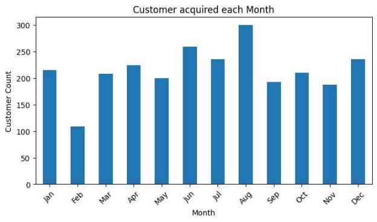
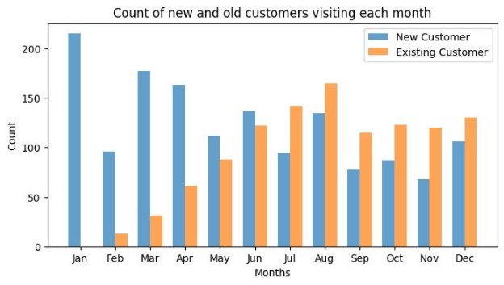
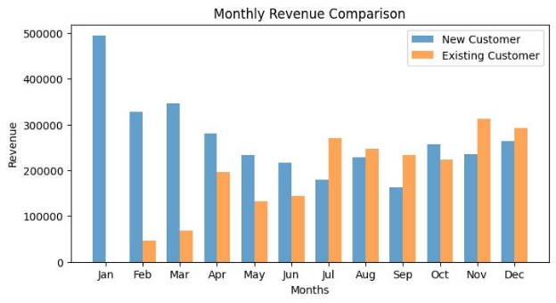
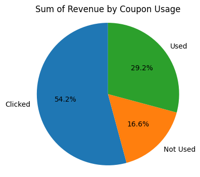
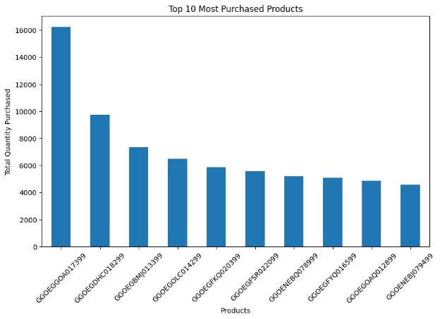

# **E-commerce Marketing and sales** 
# **insights**
In an e-commerce platform of a leading online retail company, we are facing challenges in optimizing our marketing strategies, improving customer engagement, and maximizing revenue growth. With a vast customer base and a wide range of products, it's becoming increasingly difficult to identify areas of improvement and make data-driven decisions. 

That's where data analysis comes in. By analyzing the transaction data, customer demographics, marketing spend, and discount coupon usage, we can gain valuable insights into customer behavior, preferences, and needs. You can identify trends and patterns that can inform your marketing strategies, product offerings, and customer engagement initiatives. 

## **Data Overview** 
**Online\_Sales.csv** 

- This file contains transaction-level data for online sales, including customer and product information, transaction dates, and pricing details. 

**Customers\_Data.csv** 

- This file contains demographic data for customers, including their unique IDs, gender, location, and tenure in months. 

**Discount\_Coupon.csv** 

- This file contains information on discount coupons offered to customers, including the month and product category for which the coupon is applicable, the coupon code, and the discount percentage. 

**Marketing\_Spend.csv** 

- This file contains daily marketing spend data for both offline and online channels. 

**Tax\_Amount.csv** 

- This file contains GST (Goods and Services Tax) details for different product categories, including the percentage of GST applicable. 

|File Name |Description |Variables |
| - | - | - |
|Online\_Sales.csv |Transaction-level online sales data |CustomerID, Transaction\_ID, Transaction\_Date, Product\_SKU, Product\_Description, Product\_Category, Quantity, Avg\_Price, Delivery\_Charges, Coupon\_Status |
|Customers\_Data.csv |Customer demographic data |CustomerID, Gender, Location, Tenure\_Months |
|Discount\_Coupon.csv |Discount coupon information |Month, Product\_Category, Coupon\_Code, Discount\_pct |
|Marketing\_Spend.csv |Daily marketing spend data |Date, Offline\_Spend, Online\_Spend |
|Tax\_Amount.csv |GST details for product categories |Product\_Category, GST |

Detailed dataset information about the columns can be found in the data description file.
## **EDA Business objective ![ref1]**
The e-commerce company is expecting below analysis using the data ![ref1]

1. **Calculate Invoice amount or sale\_amount or revenue for each transaction and item level** 
- Invoice Value = ((Quantity \* Avg\_price) \* (1 - Discount\_pct) \* (1 + GST)) + Delivery\_Charges 
2. **Perform Detailed exploratory analysis** 
- Understanding how many customers acquired every month 
- Understand the retention of customers on a month-on-month basis 
- How the revenues from existing/new customers on a month-on-month basis 
- How the discounts play a role in the revenues 
- Analyse KPI’s like Revenue, number of orders, average order value, number of customers (existing/new), quantity, by category, by month, by week, by day, etc. 
- Understand the trends/seasonality of sales by category, location, month, etc. 
- How the number of orders varies and sales with different days 
- Calculate the Revenue, Marketing spend, percentage of marketing spend out of revenue, Tax, percentage of delivery charges by month 
- How marketing spend is impacting on revenue 
- Which product appeared in the transactions 
- Which product was purchased mostly based on the quantity 
3. **Performing Customer Segmentation** 
- Heuristic (Value based, RFM) – Divide the customers into Premium, Gold, Silver, Standard customers and define a strategy on the same. 
4. **Perform cohort analysis by defining below cohorts** 
- Customers who started in each month and understand their behavior 
- Which Month cohort has maximum retention? 
## **Lets have a look t some of the analysis** 

We can see that more number of customers were acquired in the month of Aug roughly around 300 customers, and least number of customers were acquired in the month of Feb. 

**Retention of customers on a month-on-month basis** 

![]images/Aspose.Words.34ad650c-9d10-4395-bcf2-0f0df7b8b7b9.004.png)

**How the revenues from existing/new customers on a month-on-month basis** 

Till June the company saw huge inflow of new customers and after June it was the exsiting customers had a high inflow to the store 

Till June new customers contributed more to the revenue and after june Existing customers were the highest contributers to the revenue with an exception case that happened in october. 

**How the discounts play a role in the revenues** 

**Which product was purchased mostly based on the quantity** 

## **Analyze key performance indicators (KPIs) on product categories** 
Top 5 categories by revenue 

|**Product\_Category**|**Invoice**|**Quantity**|
| - | - | - |
|**Nest-USA**|2\.72E+06|21430|
|**Apparel**|8\.28E+05|32438|
|**Nest**|5\.21E+05|2837|
|**Office**|3\.82E+05|88383|
|**Drinkware**|2\.73E+05|30501|

Top 5 categories by quantity 

|**Product\_Category**|**Invoice**|**Quantity**|
| - | - | - |

|**Office**|3\.82E+05|88383|
| - | - | - |
|**Apparel**|8\.28E+05|32438|
|**Drinkware**|2\.73E+05|30501|
|**Lifestyle**|1\.25E+05|24881|
|**Nest-USA**|2\.72E+06|21430|
## **Understand the trends/seasonality of sales by category, location, month, etc. ![ref2]**
We can see that Nest-USA has the highest share in the revenue across all the months followed by Apperal and nest ![ref3]
## **Customer Segmentation** 
- Heuristic (Value based, RFM) – Divide the customers into Premium, Gold, Silver, Standard customers and define a strategy on the same  

|**heuristic\_segment** |**Count** |
| - | - |
|**Standard** |697|

|**Silver** |611|
| - | - |
|**Premium** |129|
|**Gold** |31|
# Insights and recommendation ![ref1]
**Insights:** 

1. **Customer Acquisition:** 
- Customer acquisition peaks in August (around 300 new customers), indicating a strong seasonal influence or the success of marketing campaigns during that period. 
- February experiences the lowest customer acquisition, suggesting a need for targeted strategies to attract customers during this slower month. 
2. **Customer Retention:** 
- Customer retention is highest in July and August, with retention counts exceeding during these months. This highlights the effectiveness of customer engagement and retention strategies implemented during this period. 
- Retention dips in other months, suggesting a need for improved customer relationship management throughout the year. 
3. **Revenue Sources:** 
- While new customers contribute significantly to revenue initially, existing customers become the dominant revenue source after June. 
- New customer revenue peaks in March, with revenue exceeding. Existing customer revenue reaches its highest point in August, with revenue exceeding. This emphasizes the importance of balancing acquisition and retention efforts. 
4. **Impact of Discounts:** 
- Coupons with a "Clicked" status drive almost 50% of the total revenue. 
- Revenue from transactions where coupons were used is significantly higher than from transactions without coupons. This highlights the importance of discount strategies in attracting and retaining customers. 
5. **Product Performance:** 
- Nest-USA products are the top revenue generators and among the most purchased products by quantity. This indicates their popularity and potential for driving sales. 
6. **Marketing ROI:** 
- A positive correlation exists between marketing spend and revenue, suggesting that marketing efforts are contributing to sales growth. 
- The correlation coefficient is [refer to notebook output]. This highlights the importance of continued investment in marketing and the need for ongoing evaluation of marketing effectiveness. 
7. **Customer Segmentation:** 
- Heuristic segmentation using RFM values reveals a significant portion of customers falling under the Standard segment, followed by Silver, Premium, and Gold. 
- This segmentation enables targeted marketing strategies for different customer groups. 
8. **Cohort Analysis:** 
- The August cohort exhibits the highest retention rate, indicating the long-term value of customers acquired during this period. 
- Other cohorts have lower retention rates, suggesting a need for improved customer engagement strategies to increase customer lifetime value. 

**Recommendations:** 

- **Targeted Marketing:** Leverage customer segmentation insights to develop personalized marketing campaigns for each segment, focusing on their unique needs and preferences. 
- **Seasonal Promotions:** Implement targeted promotions during peak months like August to capitalize on customer acquisition opportunities. Focus on strategies to boost sales during slower months like February. 
- **Optimize Discounts:** Refine coupon and discount strategies based on their effectiveness in driving revenue. Experiment with different types of discounts and target segments with tailored offers. 
- **Product Focus:** Prioritize marketing efforts for high-performing products like Nest-USA to maximize revenue. Explore opportunities to expand product offerings based on customer preferences. 
- **Customer Retention:** Implement strategies to enhance customer loyalty and retention, particularly for cohorts with lower retention rates. Focus on personalized communication and loyalty programs. 
- **Marketing Spend Optimization:** Continuously monitor marketing ROI and adjust spending to optimize returns. Explore new marketing channels and evaluate their effectiveness. 
- **Cohort Analysis:** Deep dive into the behavior of different customer cohorts to identify patterns and tailor marketing strategies for specific groups. 
- **Product Recommendations:** Implement a product recommendation system based on customer purchase history to increase sales and customer engagement. 
- **Customer Feedback:** Collect customer feedback to identify areas for improvement and enhance customer experience. Implement changes based on customer feedback to improve overall satisfaction. 

[ref1]: images/Aspose.Words.34ad650c-9d10-4395-bcf2-0f0df7b8b7b9.002.png
[ref2]: images/Aspose.Words.34ad650c-9d10-4395-bcf2-0f0df7b8b7b9.009.jpeg
[ref3]: images/Aspose.Words.34ad650c-9d10-4395-bcf2-0f0df7b8b7b9.010.jpeg
